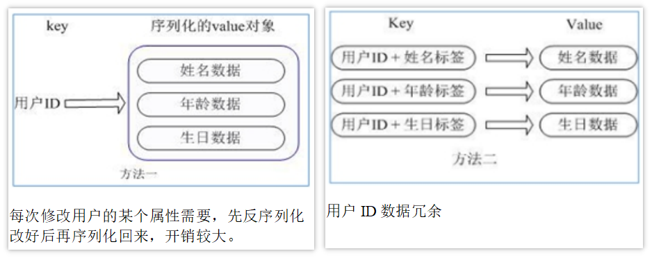
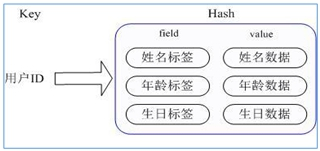

Redis hash 是一个键值对集合。

Redis hash是一个string类型的`field`和`value`的映射表，hash特别适合用于存储对象。类似Java里面的`Map<String, Object>`

用户ID为查找的key，存储的value用户对象包含姓名，年龄，生日等信息，如果用普通的key/value结构来存储

主要有以下2种存储方式：

通过`key(用户ID) + field(属性标签)`就可以操作对应属性数据了，既不需要重复存储数据，也不会带来序列化和并发修改控制的问题：

#### 常用命令

* `hset <key> <field> <value>` ：给`<key>`集合中的`<field>`键赋值`<value>`
* `hget <key> <field>` ：从`<key>`集合`<field>`取出 value 
* `hdel <key> <field>`：删除给定的key+field
* `hmset <key> <field1> <value1> <field2> <value2>...` ：批量设置hash的值
* `hexists <key> <field>` ：查看哈希表key中，给定域field是否存在。 
* `hkeys <key>` ：列出该hash集合的所有field
* `hvals <key>` ：列出该hash集合的所有value
* `hincrby <key> <field> <increment>` ：为哈希表 key 中的域 field 的值加上增量 1   -1
* `hsetnx <key> <field> <value>` ：将哈希表 key 中的域 field 的值设置为 value ，当且仅当域 field 不存在

#### 数据结构

Hash类型对应的数据结构是两种：ziplist（压缩列表），hashtable（哈希表）。当field-value长度较短且个数较少时，使用ziplist，否则使用hashtable。

