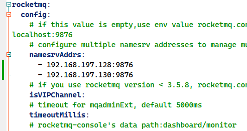
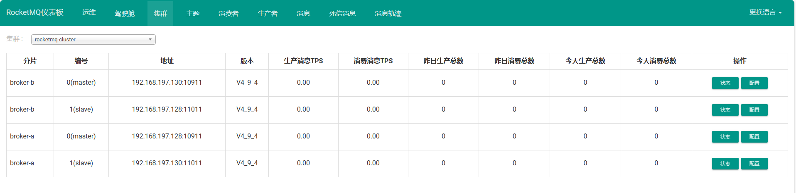

#RocketMQ 

`RocketMQ`有一个对其扩展的开源项目，这个项目是管理控制台，先将[rocketmq-dashboard](https://github.com/apache/rocketmq-dashboard)拉到本地，需要自己对`rocketmq-dashboard`进行编译打包运行。

## 下载并编译打包

```bash
git clone git@github.com:apache/rocketmq-dashboard.git
cd rocketmq-dashboard
mvn clean package -Dmaven.test.skip=true
```


注意：打包前在`rocketmq-dashboard`中配置`namesrv`集群地址：




启动rocketmq-dashboard：

```bash
nohup java -jar rocketmq-dashboard-1.0.1-SNAPSHOT.jar &
```

启动成功后，我们就可以通过浏览器访问`http://192.168.197.128:8080`进入控制台界面了，如下图：



