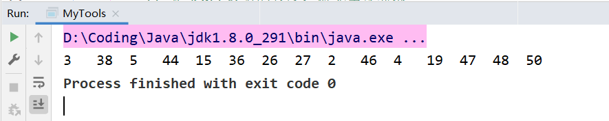
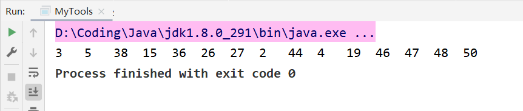
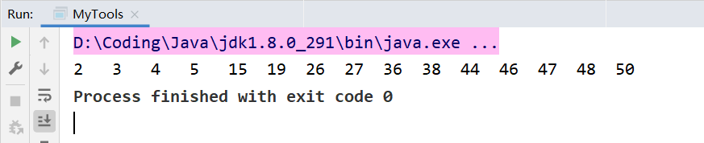

**冒泡排序**（Bubble Sort）也是一种简单直观的排序算法。它重复地走访过要排序的数列，一次比较两个元素，如果他们的顺序错误就把他们交换过来。

## 算法步骤
1. 比较相邻的元素。如果第一个比第二个大，就交换他们两个。
2. 对每一对相邻元素作同样的工作，从开始第一对到结尾的最后一对。这步做完后，最后的元素会是最大的数。
3. 针对所有的元素重复以上的步骤，除了最后一个。
4. 持续每次对越来越少的元素重复上面的步骤，直到没有任何一对数字需要比较。

## 动图演示


## 算法实现

首先定义数组：

```java
int[] arr = {3, 44, 38, 5, 47, 15, 36, 26, 27, 2, 46, 4, 19, 50, 48};
```

因为冒泡排序是将最大的数放到最后面，先不管其他的，先进行第一轮排序，由此可以得到代码：

```java
    public void bubble(int[] arr) {
        // 定义临时交换的变量，稍后用
        int temp;
        
        for (int j = 0; j < arr.length - 1; j++) {
            /*
             因为索引是从0开始，所以首先arr[0]和arr[1]做比较，而arr[1]，可以是 j + 1
             由此可以得出，第一轮排序的时候 j 要小于 len - 1，避免数组越界异常
             */
            if (arr[j] > arr[j + 1]) {
                // 如果该条件成立的话，则进行两数交换操作，使用临时变量完成交换
                temp = arr[j];
                arr[j] = arr[j + 1];
                arr[j + 1] = temp;
            }
        }
    }
```

此时执行代码可以发现，最大的数已经被放到了末尾




现在进行第二轮操作：

```java
public void bubble(int[] arr) {
        
        int temp;
        
        for (int j = 0; j < arr.length - 1; j++) {
            if (arr[j] > arr[j + 1]) {
                temp = arr[j];
                arr[j] = arr[j + 1];
                arr[j + 1] = temp;
            }
        }

        /*
         重复上面操作，
         这次 j 要小于 len - 1 - 1，第一个 1 防止数组越界异常，
         第二个 1 因为最后面的数字已经是最大的了，所以没有必要进行比较，
         */
        for (int j = 0; j < arr.length - 1 - 1; j++) {
            if (arr[j] > arr[j + 1]) {
                temp = arr[j];
                arr[j] = arr[j + 1];
                arr[j + 1] = temp;
            }
        }

    }
```

此时运行代码，可以发现第二大的数字被放在了倒数第二的位置：



因为每一轮操作后，都会把最大的数放到对应的位置，所以第三轮for循环的判断条件应该是 ` j < arr.length - 1 - 2;`，第四轮应该是 `j < arr.length - 1 - 3;`

由此规律，可以再写出一个循环，将上面写好的循环嵌入其中，这样每一轮冒泡的时候，可以是 `j < arr.length - 1 - i;`，i 是这个循环的循环变量，因为第一轮冒泡不用减，所以这个循环的循环变量 i 从0开始。

那什么时候结束呢？i 的值代表着第几轮冒泡，实际的冒泡轮数应该是数组的长度减1，因为到最后两个数字比较过后，最后一个数字是没有必要比较的，经上述分析，可以得出代码：

```java
    public void bubble(int[] arr) {
        // 定义临时交换的变量，不用在循环中频繁定义
        int temp;

        // 该外循环是冒泡的轮数
        for (int i = 0; i < arr.length - 1; i++) {
            
            // 该内循环是将相对最大的数字放到最后
            for (int j = 0; j < arr.length - 1 - i; j++) {
                if (arr[j] > arr[j + 1]) {
                    temp = arr[j];
                    arr[j] = arr[j + 1];
                    arr[j + 1] = temp;
                }
            }
            
        }
    }
```

执行代码可以发现冒泡排序已经搞定：


