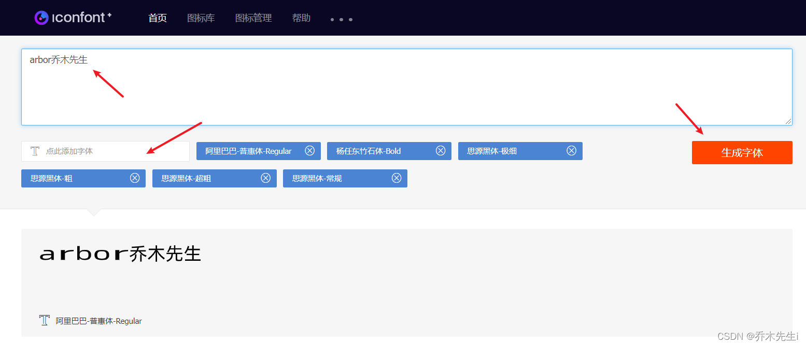

## color属性

`color`属性可设置文本内容的前景色，`color`属性主要可以用英语单词、十六进制、rgb()、rgba()等表示法。

### 英语单词表示法

比如`color: red; `，仅仅用于学习时临时设置一下颜色，工作时基本不用这样的形式，因为追求精确。

### 十六进制表示法

十六进制表示法是所有设计软件中都通用的颜色表示法，设计师给我们的设计图上面标注的颜色，通常为十六进制表示。

`color: #ff0000; `比如十六进制ff就是十进制的255，每种颜色分量都是0~255的数字。如果颜色值是`#aabbcc`的形式，可以简写为`#abc`。黑色是`#000`，白色是`#fff`，常见的灰色有`#ccc`、`#333`、 `#2f2f2f`等。

### rgb()表示法

颜色也可以用rgb()表示法，`color: rgb(255, 0, 0);`


### rgba()表示法

颜色也可以用rgba()表示法，最后一个参数表示透明度，介于0到1之间，0表示纯透明，1表示纯实心，`color: rgba(255, 0, 0, .65); `，rgba()表示法从IE9开始兼容。


## font-size属性

`font-size`属性用来设置字号，单位通常为`px`。还有`em`、`rem`单位。

```css
font-size: 30px;
```

网页文字正文字号通常是16px，浏览器最小支持10px字号

## font-weight属性

`font-weight`属性设置字体的粗细程度，通常就用`normal`和`bold`两个值

| 示例 | 意义 |
|:----|:----|
| `font-weight: normal;` | 正常粗细，与400等值 |
| `font-weight: bold;` | 加粗，与700等值 |
| `font-weight: lighter;` | 更细，大多数中文字体不支持 |
| `font-weight: bolder;` | 更粗，大多数中文字体不支持 |


## font-style属性

`font-style`属性设置字体的倾斜

| 示例 | 意义 |
|:----|:----|
| `font-style: normal;` | 取消倾斜，比如可以把天生倾斜的i、 em等标签设置为不倾斜 |
| `font-style: italic;` | 设置为倾斜字体（常用） |
| `font-style: oblique;` | 设置为倾斜字体（用常规字体模拟， 不常用） |


## text-decoration属性

`text-decoration`属性用于设置文本的修饰线外观的（下划线、删除线）

| 示例 | 意义 |
|:----|:----|
| `text-decoration: none;` | 没有修饰线 |
| `text-decoration: underline;` | 下划线 |
| `text-decoration: line-through;` | 删除线 |


## 使用案例

```html
<!DOCTYPE html>
<html lang="en">

<head>
    <meta charset="UTF-8">
    <meta name="viewport" content="width=device-width, initial-scale=1.0">
    <title>Document</title>

    <style>
        /* 字体颜色和背景颜色 */
        .para1 {
            color: brown;
        }

        .para2 {
            color: #ff3366;
        }

        .para3 {
            color: #f36;
        }

        .para4 {
            background-color: #f36;
            color: #fff;
        }

        .para5 {
            color: rgb(255, 0, 0);
        }

        .para6 {
            color: rgba(255, 0, 0, 0.1);
        }

        /* 字体加粗 */
        .para7 {
            font-weight: bold;
            /* 或者 font-weight: 700; */
        }

        h3 {
            font-weight: normal;
            /* 或者 font-weight: 400;*/
        }

        /* 字体倾斜 */
        .para8 {
            font-style: italic;
        }

        i {
            font-style: normal;
        }

        /* 下划线 */
        .para9 {
            text-decoration: underline;
        }

        a {
            text-decoration: none;
        }

        /* 删除线 */
        .para10 {
            text-decoration: line-through;
        }
    </style>
</head>

<body>

    <p class="para1">窗前明月光，疑是地上霜</p>
    <p class="para2">窗前明月光，疑是地上霜</p>
    <p class="para3">窗前明月光，疑是地上霜</p>
    <p class="para4">窗前明月光，疑是地上霜</p>
    <p class="para5">窗前明月光，疑是地上霜</p>
    <p class="para6">窗前明月光，疑是地上霜</p>
    <p class="para7">窗前明月光，疑是地上霜</p>
    <h3>窗前明月光，疑是地上霜</h3>
    <p class="para8">窗前明月光，疑是地上霜</p>
    <i>窗前明月光，疑是地上霜</i>
    <p class="para9">窗前明月光，疑是地上霜</p>
    <a href="">窗前明月光，疑是地上霜</a>
    <p class="para10">窗前明月光，疑是地上霜</p>

</body>

</html>
```

以上代码显示的效果：


## font-family属性

`font-family`属性用于设置字体，`font-family: "微软雅黑"; `，字体可以是列表形式，一般英语字体放到前面，后面的字体是前面的字体的“后备”字体 `font-family: serif, "Times New Roman", "微软雅黑"; `（字体名称中有空格，必须用引号包裹）

中文字体也可以称呼它们的英语名字
中文字体名	等价的英语字体名

```css
font-family: "微软雅黑"
font-family: "Microsoft Yahei"

font-family: "宋体"
font-family: "SimSun"
```

字体通常必须是用户计算机中已经安装好的字体，所以一般来说设置为微软雅黑和宋体较多，设置成其他字体较少，必须自己定义新字体，这就需要我们有字体文件，用户加载网页的时候，会同时下载这些字体文件


## 定义字体
字体文件根据操作系统和浏览器不同，有`eot`、`woff2`、`woff`、`ttf`、`svg`文件格式，需要同时有这5种文件

当我们拥有字体文件之后，就可以用`@font-face`定义字体

```css
@font-face {
    font-family: '字体名称';
    font-display: swap;
    src: url('eot字体文件地址');
    src: url('eot字体文件地址') format('embedded-opentype'),
        url('woff2字体文件地址') format('woff2'),
        url('woff字体文件地址') format('woff'),
        url('ttf字体文件地址') format('truetype'),
        url('svg字体文件地址') format('svg');
}
```

### 阿里巴巴普惠体
阿里巴巴提供了一套免费商用授权的普惠字体，网址：[https://www.iconfont.cn/webfont](https://www.iconfont.cn/webfont)
使用阿里巴巴普惠字体也省去了下载字体的麻烦

如果线上字体包含所有中文汉字的话，加载网页速度的时间会变慢，所以可以生成自己想要的文本的字体，一般用来做标题等等，正文内容不是很建议使用



在编辑框中输入想要生成的汉字，再选择自己想要的字体，点击生成即可


点击引用线上地址，复制这串代码加到自己的页面中即可


也可以下载到本地，导入项目中使用


## 使用案例

```html
<!DOCTYPE html>
<html lang="en">

<head>
    <meta charset="UTF-8">
    <meta name="viewport" content="width=device-width, initial-scale=1.0">
    <title>Document</title>

    <style>
        /* 定义线上字体 */
        @font-face {
            font-family: 'webfont';
            font-display: swap;
            src: url('//at.alicdn.com/t/webfont_xxi47bmh3ko.eot');
            /* IE9*/
            src: url('//at.alicdn.com/t/webfont_xxi47bmh3ko.eot?#iefix') format('embedded-opentype'),
                /* IE6-IE8 */
                url('//at.alicdn.com/t/webfont_xxi47bmh3ko.woff2') format('woff2'),
                url('//at.alicdn.com/t/webfont_xxi47bmh3ko.woff') format('woff'),
                /* chrome、firefox */
                url('//at.alicdn.com/t/webfont_xxi47bmh3ko.ttf') format('truetype'),
                /* chrome、firefox、opera、Safari, Android, iOS 4.2+*/
                url('//at.alicdn.com/t/webfont_xxi47bmh3ko.svg#杨任东竹石体-Bold') format('svg');
            /* iOS 4.1- */
        }

        /* 导入本地本地字体  就是将上面的路径换成本地路径 */
        @font-face {
            font-family: 'webfont2';
            font-display: swap;
            src: url('fonts/webfont.eot');
            /* IE9*/
            src: url('fonts/webfont.eot') format('embedded-opentype'),
                /* IE6-IE8 */
                url('fonts/webfont.woff2') format('woff2'),
                url('fonts/webfont.woff') format('woff'),
                /* chrome、firefox */
                url('fonts/webfont.ttf') format('truetype'),
                /* chrome、firefox、opera、Safari, Android, iOS 4.2+*/
                url('fonts/webfont.svg') format('svg');
            /* iOS 4.1- */
        }

        .para1 {
            font-family: '宋体';
        }

        .para2 {
            font-family: '微软雅黑';
        }

        .para3 {
            font-family: 'SimSun';
        }

        .para4 {
            font-family: 'Microsoft Yahei';
        }

        .para5 {
            /* 中文字体放后面 */
            font-family: 'Times New Roman', serif, 'Microsoft Yahei';
        }

        .para6 {
            font-family: 'webfont';
        }

        .para7 {
            font-family: 'webfont2';
        }
    </style>
</head>

<body>

    <p class="para1">arbor乔木先生</p>
    <p class="para2">arbor乔木先生</p>
    <p class="para3">arbor乔木先生</p>
    <p class="para4">arbor乔木先生</p>
    <p class="para5">arbor乔木先生</p>
    <p class="para6">arbor乔木先生</p>
    <p class="para7">arbor乔木先生</p>


</body>

</html>
```

以上html文件的预览效果


