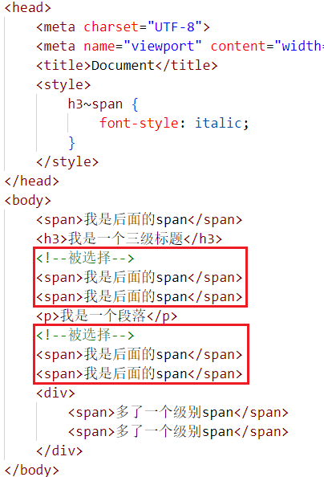

## 标签选择器

通过标签名，找到页面中所有这类标签，设置样式
1. 标签选择器选择的是一类标签，而不是单独某一个
2. 标签选择器无论嵌套关系有多深，都能找到对应的标签

```css
标签名 {
    css属性名: 属性值;
}
```


标签选择器“覆盖面”非常大，所以通常用于标签的初始化

```css
ul {
/* 
    去掉无序列表的小圆点 
    list 列表
    style 样式
    none 没有
*/
list-style: none;
}
a {
/* 
    去掉超级链接的下划线 
    text 文本
    decoration 装饰
    none 没有
*/
text-decoration: none;
}
```


## id选择器

通过id属性值，找到页面中带有这个id属性值的标签，设置样式

1. 所有标签上都有id属性
2. id属性值类似于身份证号码，在一个页面中是唯一的，不可重复的！
3. 一个标签上只能有一个id属性值
4. 一个id选择器只能选中一个标签

```css
#id属性值 {
    css属性名: 属性值;
}
```


## class选择器

通过类名，找到页面中所有带有这个类名的标签，设置样式

1. 所有标签上都有class属性，class属性的属性值称为类名（类似于名字）
2. 类名可以由数字、字母、下划线、中划线组成，但不能以数字或者中划线开头
3. 一个标签可以同时有多个类名，类名之间以空格隔开
4. 类名可以重复，一个类选择器可以同时选中多个标签


```css
.类名 {
    css属性名: 属性值;
}

```


### 原子类

在做网页项目前，可以将所有的常用字号、文字颜色、行高、外边距、内边距等都设置为单独的类，HTML标签就可以“按需选择”它的类名了，这样可以非常快速的添加一些常见样式

```css
/*
    font 字体
    size 尺寸
    12px 12像素
*/
.fs12 {
    font-size: 12px;
}
.fs14 {
    font-size: 14px;
}
.fs16 {
    font-size: 16px;
}
.color-red {
    color: red;
}
.color-blue {
    color: blue;
}
.color-green {
    color: green;
}
```


```html
<p class="fs18 color-green">我是一个文字</p>
```

## 类与id的区别

**class类名与id属性值的区别**
- class类名相当于姓名，可以重复，一个标签可以同时有多个class类名
- id属性值相当于身份证号码，不可重复，一个标签只能有一个id属性值

**类选择器与id选择器的区别**
- 类选择器以 `.` 开头
- id选择器以 `#` 开头

**实际开发的情况**
- 类选择器用的最多
- id一般配合js使用，除非特殊情况，否则不要使用id设置样式
- 实际开发中会遇到冗余代码的抽取 （可以将一些公共的代码抽取到一个公共的类中去）

## 通配符选择器

找到页面中所有的标签，设置样式

1. 开发中使用极少，只会在极特殊情况下才会用到
2. 可能会用于去除标签默认的margin和padding

```css
* {
    css属性名: 属性值;
}
```


## 复合选择器

选择器可以任何搭配、结合，从而形成复合选择器，我们必须要能一目了然的看出选择器代表的含义

| 选择器名称 | 举例 | 距离的意义 |
|:---- |:----|:----|
| 后代选择器 | `.box .spec` | 选择类名为box的标签内部的类名为spec的标签 |
|交集选择器 | `li.spec` | 选择既是li标签，也属于spec类的标签 |
|并集选择器 | `ul, ol` | 选择所有ul和ol标签 |


## 后代选择器

根据 HTML 标签的嵌套关系，选择父元素后代中满足条件的元素
在选择器1所找到标签的后代（儿子、孙子、重孙子…）中，找到满足选择器2的标签，设置样式

1. 后代包括：儿子、孙子、重孙子……
2. 后代选择器中，选择器与选择器之前通过空格隔开
3. 后代选择器可以有很多空格，隔开好几代


CSS选择器中，使用空格表示“后代”

```css
选择器1 选择器2 {
    css
}
```


## 交集选择器

选中页面中同时满足多个选择器的标签

（既又原则）找到页面中 既 能被选择器1选中，又 能被选择器2选中的标签，设置样式
1. 交集选择器中的选择器之间是紧挨着的，没有东西分隔
2. 交集选择器中如果有标签选择器，标签选择器必须写在最前面

```css
选择器1选择器2 {
    css
}
```

选择有 `.spec` 类的 `h3` 标签，此时应该使用交集选择器

```css
h3.spec {
    font-style: italic;
}
```


## 并集选择器

同时选择多组标签，设置相同的样式

找到选择器1和选择器2选中的标签，设置样式

1. 并集选择器中的每组选择器之间通过 , 分隔
2. 并集选择器中的每组选择器可以是基础选择器或者复合选择器
3. 并集选择器中的每组选择器通常一行写一个，提高代码的可读性

```css
选择器1, 选择器2 {
    css
}
```

```css
ul, ol {
    list-style: none;
}
```

## 伪类选择器

伪类是添加到选择器的描述性词语，指定要选择的元素的特殊状态，超级链接拥有4个特殊状态

**例如a标签：**

| 伪类 | 意义 |
|:----|:----|
| `a:link` | 没有被访问的超级链接 |
| `a:visited` | 已经被访问过的超级链接 |
| `a:hover` | 正被鼠标悬停的超级链接 |
| `a:active` | 正被激活的超级链接（按下按键但是还没有松开按键） |

a标签的伪类书写，要按照顺序，否则会有伪类不生效

### CSS3新增伪类

| 伪类 | 意义 |
|:----|:----|
| `:empty` | 选择空标签 |
| `:focus` | 选择当前获得焦点的表单元素 |
| `:enabled` | 选择当前有效的表单元素 |
| `:disabled` | 选择当前无效的表单元素 |
| `:checked` | 选择当前已经勾选的单选按钮或者复选框 |
| `:root` | 选择根元素，即 `<html>` 标签 |

## 属性选择器

| 举例 | 意义 |
|:----|:----|
| `img[alt]` | 选择有`alt`属性的`img`标签 |
| `img[alt="故宫"]` | 选择`alt`属性**是故宫**的`img`标签 |
| `img[alt^="北京"]` | 选择`alt`属性**以北京开头**的`img`标签 |
| `img[alt$="夜景"]` | 选择`alt`属性**以夜景结尾**的`img`标签 |
| `img[alt*="美"]` | 选择有`alt`属性中**含有美字**的`img`标签 |
| `img[alt~="手机拍摄"]` | 选择有`alt`属性中**有空格隔开的手机拍摄字样**的`img`标签 |
| `img[alt|="参赛作品"]` | 选择有`alt`属性**以“参赛作用-”开头**的`img`标签 |

## 元素关系选择器

| 名称 | 举例 | 意义 |
|:----|:----|:----|
| 子选择器 | `div>p` | div的子标签p |
| 相邻兄弟选择器 | `img+p` | 图片后面紧跟着的段落将被选中 |
| 通用兄弟选择器 | `p~span` | p元素之后的所有同层级span元素 |


### 子选择器

根据 HTML 标签的嵌套关系，选择父元素子代中满足条件的元素

> 在选择器1所找到标签的子代（儿子）中，找到满足选择器2的标签，设置样式

1. 子代只包括：儿子
2. 子代选择器中，选择器与选择器之前通过 `>` 隔开


```css
选择器1 > 选择器2 {
    css
}
```


### 相邻兄弟选择器

相邻兄弟选择器 (`+`) 介于两个选择器之间，当第二个元素紧跟在第一个元素之后，并且两个元素都是属于同一个父元素的子元素，则第二个元素将被选中，说白了，`a+b`就是选择“**紧跟在a后面的一个b**”，相邻兄弟选择器从IE7开始兼容


### 通用兄弟选择器

通用兄弟选择器（`~`），`a~b` **选择a元素之后所有同层级b元素**，通用兄弟选择器从IE7开始兼容




## 序号选择器

| 举例                   | 意义                  | 兼容性 |
|:---------------------- |:--------------------- |:------ |
| `:first-child`         | 第一个子元素          | IE7    |
| `:last-child`          | 最后一个子元素        | IE9    |
| `:nth-child(3)`        | 第3个子元素           | IE9    |
| `:nth-of-type(3)`      | 第3个某类型子元素     | IE9    |
| `:nth-last-child(3)`   | 倒数第3个子元素       | IE9    |
| `:nth-last-of-type(3)` | 倒数第3个某类型子元素 | IE9    |


### :first-child

表示“选择第一个子元素”，比如下面的例子就表示选择`.box1`盒子中第一个`p`

```css
.box1 p:first-child {
color: red;
}
```

```html
<div class="box1">
    <p>1</p> <!--被选择-->
    <p>2</p>
    <p>3</p>
    <p>4</p>
</div>
```


### :last-child

表示“选择最后一个子元素”，比如下面的例子就表示选择`.box1`盒子中最后一个`p`

```css
.box1 p:last-child {
color: red;
}
```

```html
<div class="box1">
    <p>1</p>
    <p>2</p>
    <p>3</p>
    <p>4</p> <!--被选择-->
</div>
```


### :nth-child()

`:nth-child()`可以选择任意序号的子元素

```css
.box2 p:nth-child(3) {
color: green;
}
```

```html
<div class="box2">
    <p>1</p>
    <p>2</p>
    <p>3</p> <!--被选择-->
    <p>4</p>
</div>
```


`:nth-child()`可以写成`an + b`的形式，表示**从b开始每a个选 一个**，**注意不能写为b + an**

```css
.box2 p:nth-child(3n + 2) {
color: green;
}
```

```html
<div class="box2">
    <p>1</p>
    <p>2</p> <!--被选择-->
    <p>3</p>
    <p>4</p>
    <p>5</p> <!--被选择-->
    <p>6</p>
    <p>7</p>
    <p>8</p> <!--被选择-->
</div>
```


`2n+1`等价于`odd`，**表示奇数**
`2n`等价于`even`，**表示偶数**

```css
.box2 p:nth-child(2n + 1) {
    color: green;
}
.box2 p:nth-child(odd) {
    color: green;
}
.box2 p:nth-child(2n) {
    color: green;
}
.box2 p:nth-child(even) {
    color: green;
}
```


### :nth-of-type()

`:nth-of-type()`将选择同种标签指定序号的子元素

```css
.box4 p:nth-of-type(3) {
color: blue;
}
```

```html
<div class="box4">
    <p>我是1号p</p>
    <p>我是2号p</p>
    <h3>我是1号h3</h3>
    <h3>我是2号h3</h3>
    <p>我是3号p</p>  <!--被选择-->
    <p>我是4号p</p>
    <h3>我是3号h3</h3>
    <h3>我是4号h3</h3>
</div>
```


### :nth-last-child()
### :nth-last-of-type()

`:nth-last-child()`和`:nth-last-of-type()`都是倒数选择

```css
.box5 p:nth-last-child(2) {
color: red;
}
```

```html
<div class="box5">
    <p>我是1号p</p>
    <p>我是2号p</p>
    <p>我是3号p</p> <!--被选择-->
    <p>我是4号p</p>
</div>
```


## 伪元素

CSS3新增了 **“伪元素”** 特性，顾名思义，表示虚拟动态创建的元素，伪元素用双冒号表示，IE8可以兼容单冒号。

### ::before和::after

`::before`创建一个伪元素，其将成为匹配选中的元素的第 一个子元素，必须设置`content`属性表示其中的内容
`::after`创建一个伪元素，其将成为匹配选中的元素的最后 一个子元素，必须设置`content`属性表示其中的内容


```css
a::before {
content: "★";
}
```


### ::selection

`::selection`CSS伪元素应用于文档中被用户高亮的部分（使用鼠标圈选的部分）


### ::first-letter

`::first-letter`会选中某元素中（必须是块级元素）第一行的第一个字母

### ::first-line

`::first-line`会选中某元素中（必须是块级元素）第一行全部文字