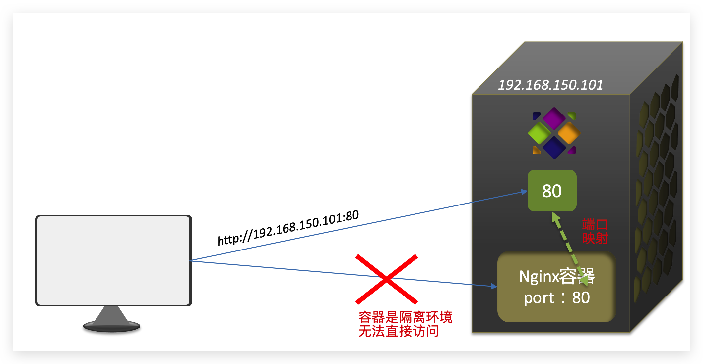

容器操作的命令如图：


## 容器命令

```bash
# 创建并运行一个容器，运行成功后会返回容器id
docker run

# 暂停，将容器挂起，内存暂存，CPU不再执行
docker pause
# 恢复运行，内存恢复，CPU恢复
docker unpause

# 停止容器，杀死进程，回收内存
docker stop
# 启动容器，创建新的进程
docker start

# 查看所有运行的容器和状态
docker ps
# 查看容器运行日志
docker logs
# 进入容器执行命令
docker exec

# 删除指定容器，先停止，然后删除所有相关文件
docker rm
```


### 创建并运行一个容器

举例：`docker run --name containerName -p 80:80 -d nginx`

* `docker run`：创建并运行一个容器
* `--name`：给容器起一个名字
* `-p`：容器端口映射，左侧得是宿主机器的端口，右侧是容器端口

> 默认情况下，容器是隔离环境，直接访问宿主机的80端口，是访问不到容器中的nginx。

> 将容器的80与宿主机的80关联起来，当访问宿主机的80端口时，就会被映射到容器的80，这样就能访问到nginx了。

* `-d` ：后台运行容器
* `nginx` ：镜像名称，可以指定版本号，这里指的是运行最新版本的nginx



### 进入容器执行命令

容器内部会模拟一个独立的Linux文件系统，看起来如同一个linux服务器一样

举例：`docker exec -it mynginx bash` 

* `docker exec`：进入容器内部，执行一个命令
* `-it`：给当前进入的容器创建一个标准输入、输出终端，允许与容器交互
* `mynginx`：要进入的容器的名称

* `bash`：进入容器后执行的命令，bash是一个linux终端交互命令


## 创建运行Nginx容器\[例\]

### 查看帮助文档

在Docker Hub上查看帮助文档

找到Nginx的详情页，往下拉，有个使用指南


### 运行容器

```bash
docker run --name mynginx -p 80:80 -d nginx
```


### 查看所有容器状态

```bash
docker ps
```


### 访问Nginx


### 查看容器日志

```bash
docker logs mynginx
```


### 持续日志输入

```bash
docker logs -f mynginx
```

使用`ctrl` + `c` 关闭持续输出


### 进入容器操作

进入容器之后，nginx的环境、配置、运行文件全部都在这个文件系统中，包括想要修改的html文件。

```bash
docker exec -it mynginx bash
```


### 修改Nginx文件

查看DockerHub网站中的nginx页面，可以知道nginx的html目录位置在`/usr/share/nginx/html`

```bash
cd /usr/share/nginx/html
```


容器内部没有`vi` 命令，无法直接修改，可以使用下面的命令：

```bash
sed -i -e 's#Welcome to nginx#祝月薪过万#g' -e 's#<head>#<head><meta charset="utf-8">#g' index.html
```


### 退出容器

```bash
exit
```


### 停止容器

```bash
docker stop mynginx
```


### 查看包括已停止容器的状态

```bash
docker ps -a
```


### 删除容器

```bash
docker rm mynginx
```


### 强制删除运行的容器

```bash
docker rm -f mynginx
```


## 创建运行Redis容器\[例\]

```bash
docker run --name redis -p 6379:6379 -d redis redis-server --appendonly yes
```

* `redis-server --appendonly yes`：持久化操作