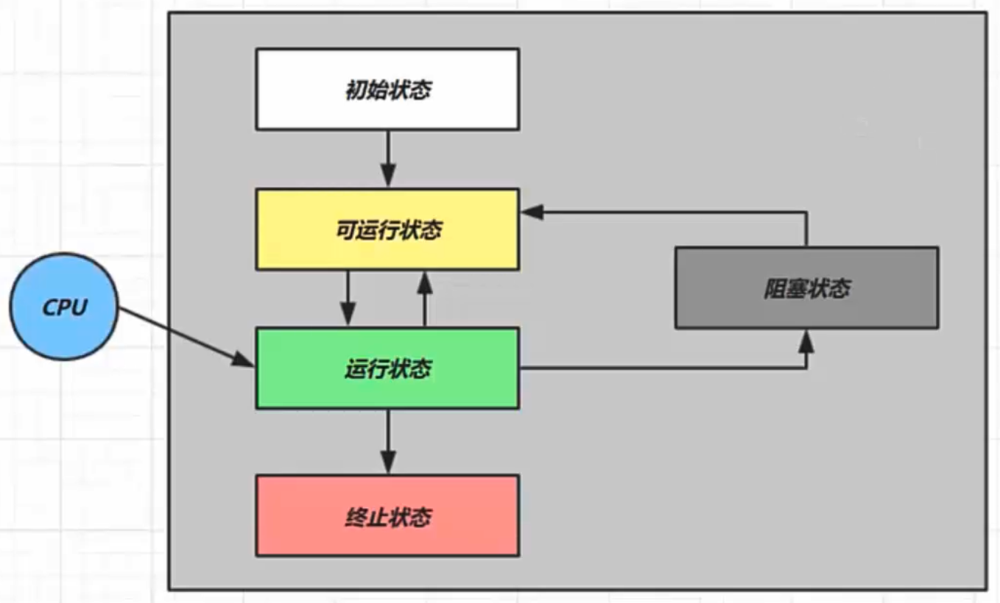

---
tags:
  - Java/并发编程
---

## 创建线程

### 方式一：Thread类

Java使用 `java.lang.Thread` 类代表线程，所有的线程对象都必须 `Thread` 类或其子类的实例。每个线程的作用是完成一定的任务，实际上就是执行一段程序流即一段顺序执行的代码。Java使用线程执行体来代表这段程序流。

```java
// 创建线程对象
Thread t = new Thread() {
    public void run() {
        // 要执行的任务
    }
};

// 启动线程
t.start();
```


案例：

```java
@Slf4j
public class Main {
    public static void main(String[] args) {

        // 构造方法的参数可以执行线程的名字
        Thread t = new Thread("t1") {
            @Override
            public void run() {
                // run方法内指定了线程要执行的任务
                log.debug("hello");
            }
        };

        // 启动线程
        t.start();
    }
}
```

> 也可以创建一个类继承Thread类，然后调用子类的 `start`  方法。


### 方式二：Runnable接口

> Java不支持多继承，如果继承了其他类则无法继承Thread类，则需要实现 Runnable 接口。如果不打算重写Thread类的其他方法，也可以选择实现 Runnable 接口。

`java.lang.Runnable` 是Java中用以实现线程的接口，只需要重写 `run` 方法即可。任何实现线程功能的类都必须实现此接口。

把【线程】和【任务】（要执行的代码）分开：

* Thread 代表线程
* Runnable 可运行的任务（线程要执行的代码）

```java
Runnable runnable = new Runnable() {
    @Override
    public void run() {
        // run方法内指定了线程要执行的任务
    }
};
// 创建线程对象
Thread t = new Thread(runnable);
// 启动线程
t.start();
```


案例：

```java
@Slf4j
public class RunnableTest {
    public static void main(String[] args) {

        Runnable runnable = new Runnable() {
            @Override
            public void run() {
                // run方法内指定了线程要执行的任务
                log.debug("hello");
            }
        };

        // 创建线程对象
        Thread t = new Thread(runnable);

        // 启动线程
        t.start();
    }
}
```


java8以后可以使用lambda精简代码：

```java
Runnable runnable = () -> log.debug("hello");
// 创建线程对象，参数2是线程的名字
Thread t = new Thread(runnable, "r");
// 启动线程
t.start();
```


### Thread和Runnable的关系
实现 `Runnable` 接口比继承 `Thread` 类所具有的优势：

* 方法1 是把线程和任务合并在了一起，方法2 是把线程和任务分开了，所以 `Runnable` 接口适合多个相同的程序代码的线程去共享同一个资源
* 用 Runnable 让任务类脱离了 Thread 继承体系，避免java中的单继承的局限性
* 用 Runnable 更容易与线程池等高级 API 配合，线程池只能放入实现Runable或Callable类线程，不能直接放入继承Thread的类
* 增加程序的健壮性，实现解耦操作，代码可以被多个线程共享，代码和线程独立

在 Java 中，每次程序运行至少启动2个线程。一个是main线程，一个是垃圾收集线程。因为每当使用java命令执行一个类的时候，实际上都会启动一个JVM，每一个JVM其实在就是在操作系统中启动了一个进程。


### 方式三：FutureTask配合Thread
FutureTask 能够接收 Callable 类型的参数，用来处理有返回结果的情况。

FutureTask 实现了 RunnableFuture 接口，间接实现了 Runnable 接口和 Future 接口。

而 Callable 的 call 方法可以有方法的返回值并且可以抛出异常，从而实现线程间的参数传递。

```java
// 创建任务对象
FutureTask<Integer> futureTask = new FutureTask<>(() -> {
    log.debug("hello");
    return 100;
});

// 创建并启动一个线程，参数1是任务对象，参数2是线程名
new Thread(futureTask, "f").start();
// 主线程阻塞，同步等待futureTask执行完毕的结果
Integer result = futureTask.get();
log.debug("futureTask的结果是：{}", result);
```

结果：


## 查看进程线程的方法

### windows
任务管理器可以查看进程和线程数，也可以用来杀死进程

* `tasklist` ：查看进程
* `taskkill` ：杀死进程


### Linux
* `ps -fe` ：查看所有进程
* `ps -fT -p <PID>`  ：查看某个进程（PID）的所有线程
* `kill` ：杀死进程
* `top` ：按大写 H 切换是否显示线程
* `top -H -p <PID>`  ：查看某个进程（PID）的所有线程


### Java
* `jps` ：命令查看所有 Java 进程
* `jstack <PID>`  ：查看某个 Java 进程（PID）的所有线程状态
* `jconsole` ：来查看某个 Java 进程中线程的运行情况（图形界面）


#### jconsole 远程监控配置
需要以如下方式运行 java 类：

```bash
java -Djava.rmi.server.hostname=`ip地址` -Dcom.sun.management.jmxremote -
Dcom.sun.management.jmxremote.port=`连接端口` -Dcom.sun.management.jmxremote.ssl=是否安全连接 -
Dcom.sun.management.jmxremote.authenticate=是否认证 java类
```


如果要认证访问，还需要做如下步骤：

* 复制 `jmxremote.password` 文件
* 修改 `jmxremote.password` 和 `jmxremote.access` 文件的权限为 600 即文件所有者可读写
* 连接时填入 controlRole（用户名），R&D（密码）


## 线程运行原理

### 栈与栈帧
Java Virtual Machine Stacks （Java 虚拟机栈）

JVM 中由堆、栈、方法区所组成，其中栈内存就是给线程使用的，每个线程启动后，虚拟机就会为其分配一块栈内存。

* 每个栈由多个栈帧（Frame）组成，对应着每次方法调用时所占用的内存
* 每个线程只能有一个活动栈帧，对应着当前正在执行的那个方法


### 线程上下文切换（Thread Context Switch）
因为以下一些原因导致 cpu 不再执行当前的线程，转而执行另一个线程的代码

* 线程的 cpu 时间片用完
* 垃圾回收
* 有更高优先级的线程需要运行
* 线程自己调用了 sleep、yield、wait、join、park、synchronized、lock 等方法

当 Context Switch 发生时，需要由操作系统保存当前线程的状态，并恢复另一个线程的状态，Java 中对应的概念就是程序计数器（Program Counter Register），它的作用是记住下一条 jvm 指令的执行地址，是线程私有的

* 状态包括程序计数器、虚拟机栈中每个栈帧的信息，如局部变量、操作数栈、返回地址等
* Context Switch 频繁发生会影响性能


## 守护线程
默认情况下，Java 进程需要等待所有线程都运行结束，才会结束。有一种特殊的线程叫做守护线程，只要其它非守护线程运行结束了，即使守护线程的代码没有执行完，也会强制结束。

```java
public static void main(String[] args) throws InterruptedException {
    log.debug("开始运行...");
    Thread t1 = new Thread(() -> {
        log.debug("t1线程开始运行...");
        try {
            Thread.sleep(5000);
        } catch (InterruptedException e) {
            e.printStackTrace();
        }
        log.debug("t1线程结束运行...");
    }, "t1");
    t1.setDaemon(true);
    t1.start();
    Thread.sleep(1000);
    log.debug("结束运行...");
}
```


t1线程并没有运行结束，程序就结束了


## 五种状态

这是从 操作系统 层面来描述的




* 【初始状态】仅是在语言层面创建了线程对象，还未与操作系统线程关联
* 【可运行状态】（就绪状态）指该线程已经被创建（与操作系统线程关联），可以由 CPU 调度执行
* 【运行状态】指获取了 CPU 时间片运行中的状态
   * 当 CPU 时间片用完，会从【运行状态】转换至【可运行状态】，会导致线程的上下文切换
* 【阻塞状态】
   * 如果调用了阻塞 API，如 BIO 读写文件，这时该线程实际不会用到 CPU，会导致线程上下文切换，进入【阻塞状态】
   * 等 BIO 操作完毕，会由操作系统唤醒阻塞的线程，转换至【可运行状态】
* 与【可运行状态】的区别是，对【阻塞状态】的线程来说只要它们一直不唤醒，调度器就一直不会考虑调度它们
* 【终止状态】表示线程已经执行完毕，生命周期已经结束，不会再转换为其它状态


## 六种状态
这是从 Java API 层面来描述的

根据 `Thread.State` 枚举，分为六种状态：


* NEW 线程刚被创建，但是还没有调用 start() 方法
* RUNNABLE 当调用了 start() 方法之后，注意，Java API 层面的 RUNNABLE 状态涵盖了 操作系统 层面的【可运行状态】、【运行状态】和【阻塞状态】（由于 BIO 导致的线程阻塞，在 Java 里无法区分，仍然认为是可运行）
* BLOCKED ， WAITING ， TIMED_WAITING 都是 Java API 层面对【阻塞状态】的细分
* TERMINATED 当线程代码运行结束