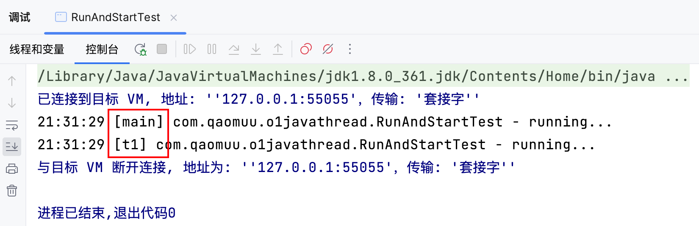
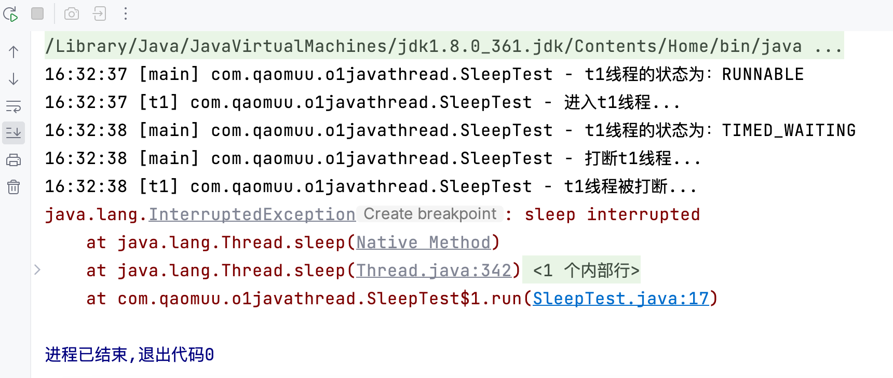
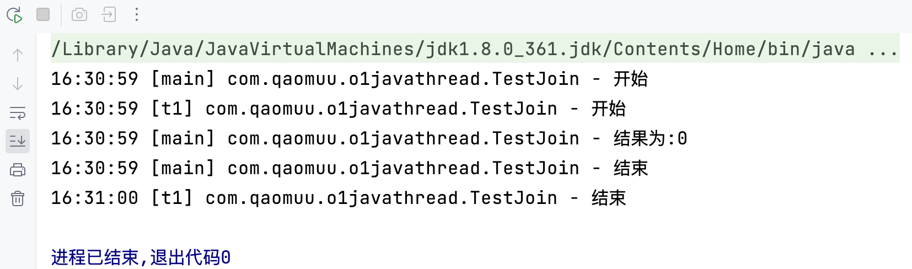
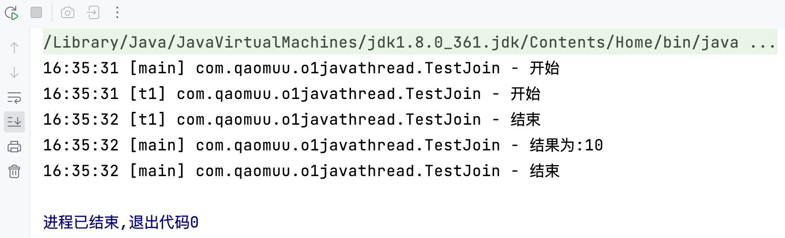
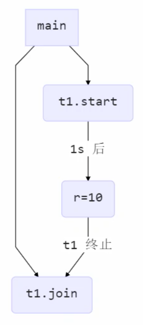
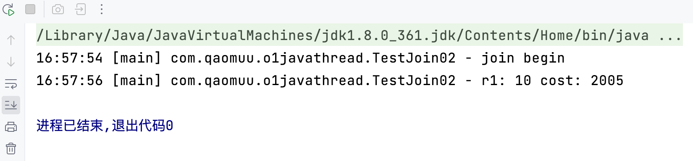
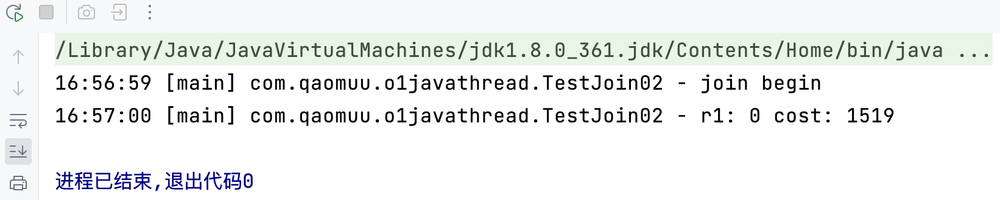
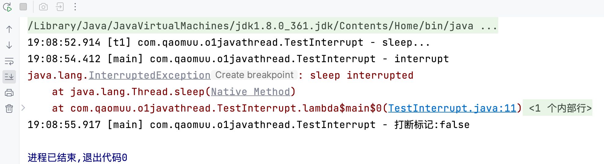
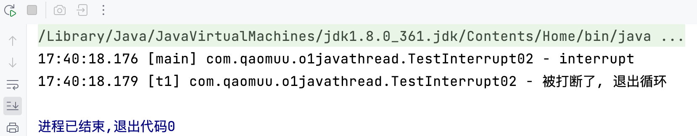
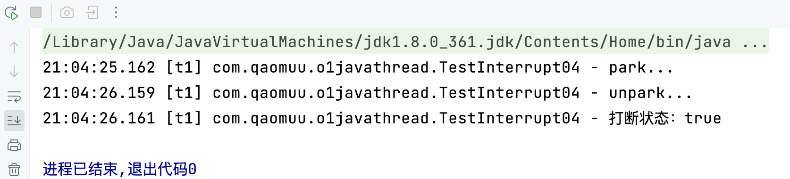

---
tags:
  - Java/并发编程
---


## 常见方法
|方法名|static|功能说明|注意|
| ----- | ----- | ----- | ----- |
|start()| |启动一个新线程，在新的线程运行 run 方法中的代码|start 方法只是让线程进入就绪，里面代码不一定立刻运行（CPU 的时间片还没分给它）。每个线程对象的start方法只能调用一次，如果调用了多次会出现 `IllegalThreadStateException` |
|run()| |新线程启动后会调用的方法|如果在构造 Thread 对象时传递了 Runnable 参数，则线程启动后会调用 Runnable 中的 run 方法，否则默认不执行任何操作。但可以创建 Thread 的子类对象，来覆盖默认行为|
|join()| |等待线程运行结束| |
|join(long n) | |等待线程运行结束，最多等待 n毫秒| |
|getId()| |获取线程长整型的 id|id 唯一|
|getName()| |获取线程名| |
|setName(String)| |修改线程名| |
|getPriority()| |获取线程优先级| |
|setPriority(int)| |修改线程优先级|java中规定线程优先级是1~10 的整数，较大的优先级能提高该线程被 CPU 调度的机率|
|getState()| |获取线程状态|Java 中线程状态是用 6 个 enum 表示，分别为：NEW，RUNNABLE， BLOCKED，WAITING，TIMED\_WAITING， TERMINATED|
|isInterrupted()| |判断是否被打断|不会清除打断标记|
|isAlive()| |线程是否存活|（还没有运行完毕）|
|interrupt()| |打断线程|如果被打断线程正在 sleep，wait，join 会导致被打断的线程抛出 InterruptedException，并清除 打断标记；如果打断的正在运行的线程，则会设置 打断标记；park 的线程被打断，也会设置 打断标记|
|interrupted()|static|判断当前线程是否被打断|会清除打断标记|
|currentThread()|static|获取当前正在执行的线程| |
|sleep(long n)|static|让当前执行的线程休眠n毫秒，休眠时让出 cpu的时间片给其它线程| |
|yield()|static|提示线程调度器让出当前线程对CPU的使用|主要是为了测试和调试|


## start与run

```java
public static void main(String[] args) {
    Thread t1 = new Thread("t1") {
        @Override
        public void run() {
            log.debug("running...");
        }
    };
    t1.run();
    t1.start();
}
```
调用上面的方法：




* 直接调用 run 是在主线程中执行了 run，没有启动新的线程
* 使用 start 是启动新的线程，通过新的线程间接执行 run 中的代码


## sleep 与 yield
### sleep
1. 调用 sleep 会让当前线程从 Running 进入 Timed Waiting 状态（阻塞）
2. 其它线程可以使用 interrupt 方法打断正在睡眠的线程，这时 sleep 方法会抛出 InterruptedException
3. 睡眠结束后的线程未必会立刻得到执行
4. 建议用 TimeUnit 的 sleep 代替 Thread 的 sleep 来获得更好的可读性

```java
public static void main(String[] args) {
    Thread t1 = new Thread("t1") {
        @Override
        public void run() {
            log.info("进入t1线程...");
            try {
                TimeUnit.SECONDS.sleep(2);
            } catch (InterruptedException e) {
                log.info("t1线程被打断...");
                e.printStackTrace();
            }
        }
    };
    t1.start();
    log.info("t1线程的状态为：{}", t1.getState());
    try {
        Thread.sleep(1000);
    } catch (InterruptedException e) {
        throw new RuntimeException(e);
    }
    log.info("t1线程的状态为：{}", t1.getState());
    log.info("打断t1线程...");
    t1.interrupt();
}
```




### yield
1. 调用 yield 会让当前线程从 Running 进入 Runnable 就绪状态，然后调度执行其它线程
2. 具体的实现依赖于操作系统的任务调度器


### 线程优先级
线程优先级会提示（hint）调度器优先调度该线程，但它仅仅是一个提示，调度器可以忽略它。

如果 cpu 比较忙，那么优先级高的线程会获得更多的时间片，但 cpu 闲时，优先级几乎没作用。

```java
public static void main(String[] args) {
    Runnable task1 = () -> {
        int count = 0;
        for (;;) {
            System.out.println("---->1 " + count++);
        }
    };
    Runnable task2 = () -> {
        int count = 0;
        for (;;) {
            // Thread.yield();
            System.out.println("              ---->2 " + count++);
        }
    };
    Thread t1 = new Thread(task1, "t1");
    Thread t2 = new Thread(task2, "t2");
    // t1.setPriority(Thread.MIN_PRIORITY);
    // t2.setPriority(Thread.MAX_PRIORITY);
    t1.start();
    t2.start();
}
```
* 正常情况下，两个线程同时打印数字，到程序停止时，count的值应该差不多大
* 在使用 `yield`  方法的情况下，线程2的count会比线程1的count小不少
* 在设置线程优先级后(不使用 `yield` 方法)，线程1的优先级设置为最低，线程2的优先级设置为最高，程序停止时，线程2的count明显比线程1的count大很多


## join方法

```java
static int r = 0;
public static void main(String[] args) {
    log.debug("开始");
    Thread t1 = new Thread(() -> {
        log.debug("开始");
        try {
            TimeUnit.SECONDS.sleep(1);
        } catch (InterruptedException e) {
            throw new RuntimeException(e);
        }
        log.debug("结束");
        r = 10;
    },"t1");
    t1.start();
    // t1.join();
    log.debug("结果为:{}", r);
    log.debug("结束");
}
```
因为主线程和线程 t1 是并行执行的，t1 线程需要 1 秒之后才能算出 r=10，而主线程一开始就要打印 r 的结果，所以只能打印出 r=0。




使用join方法，加在t1.start()之后即可，在使用join方法之后，main线程将会等待t1线程运行完毕后继续执行：







### 有时效的join

```java
static int r1 = 0;
public static void main(String[] args) throws InterruptedException {
    Thread t1 = new Thread(() -> {
        try {
            TimeUnit.SECONDS.sleep(2);
        } catch (InterruptedException e) {
            throw new RuntimeException(e);
        }
        r1 = 10;
    });
    long start = System.currentTimeMillis();
    t1.start();
    // 线程执行结束会导致 join 结束
    log.debug("join begin");
    t1.join(3000);
    long end = System.currentTimeMillis();
    log.debug("r1: {} cost: {}", r1, end - start);
}
```




而如果将 `t1.join(3000)`  改为 `t1.join(1500)`  ，可以看到main线程只等了1.5秒，并没有等待t1线程之行结束：




## interrupt方法

### 打断 sleep，wait，join 的线程
这几个方法都会让线程进入阻塞状态

打断 sleep 的线程, 会清空打断状态，以 sleep 为例

```java
public static void main(String[] args) throws InterruptedException {
    Thread t1 = new Thread(() -> {
        log.debug("sleep...");
        try {
            Thread.sleep(3000); // wait, join
        } catch (InterruptedException e) {
            e.printStackTrace();
        }
    }, "t1");
    t1.start();
    Thread.sleep(1500);
    log.debug("interrupt");
    t1.interrupt();
    Thread.sleep(1500);
    log.debug("打断标记:{}", t1.isInterrupted());
}
```




### 打断正常运行的线程
打断正常运行的线程，不会清空打断状态

```java
public static void main(String[] args) throws InterruptedException {
    Thread t1 = new Thread(() -> {
        while (true) {
            boolean interrupted = Thread.currentThread().isInterrupted();
            if (interrupted) {
                log.debug("被打断了, 退出循环");
                break;
            }
        }
    }, "t1");
    t1.start();
    Thread.sleep(1000);
    log.debug("interrupt");
    t1.interrupt();
}
```




### 打断park线程

打断 park 线程，不会清空打断状态

```java
public static void main(String[] args) throws InterruptedException {
    Thread t1 = new Thread(() -> {
        log.debug("park...");
        LockSupport.park();
        log.debug("unpark...");
        log.debug("打断状态：{}", Thread.currentThread().isInterrupted());
    }, "t1");
    t1.start();;
    Thread.sleep(1000);
    t1.interrupt();
}
```




如果打断标记已经是 true，再使用 park 方法会失效，可以使用 `Thread.interrupted()` 清除打断状态


## 不推荐使用的方法

还有一些不推荐使用的方法，这些方法已过时，容易破坏同步代码块，造成线程死锁

|方法名|功能说明|
| ----- | ----- |
|stop()|停止线程运行|
|suspend()|挂起（暂停）线程运行|
|resume()|恢复线程运行|


