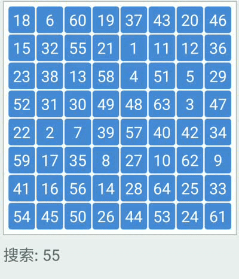
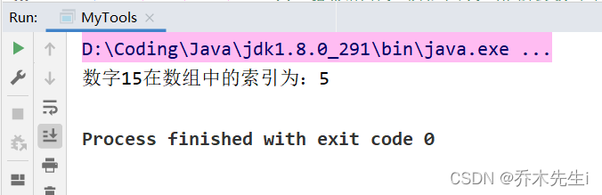

线性查找又称顺序查找，是一种最简单的查找方法，它的基本思想是从第一个记录开始，逐个比较记录的关键字，直到和给定的K值相等，则查找成功；若比较结果与文件中n个记录的关键字都不等，则查找失败。




因为比较简单，一层for循环足矣，直接上代码：

```java
    /**
     * 线性查找法
     *
     * @param arr 需要查询的数组
     * @param num 需要查询的数字
     * @return 该数字在数组中的索引
     */
    public static int linear(int[] arr, int num) {
        // 顺序查找是根据数组的索引顺序，从0开始到数组的最后一个索引结束
        // 这里可以使用for循环进行遍历查找
        // i < arr.length 表示当i等于数组最后一个索引值的时候跳出循环，防止数组越界异常
        for (int i = 0; i < arr.length; i++) {
            // 判断该数组中索引为i的值是否等于num
            if (arr[i] == num) {
                // 如果相等，则返回i，得到该数字在数组中的索引值
                return i;
            }
        }
        // 如果方法到这里还没有结束，说明数组中没有num，可以返回-1表示查询失败
        return -1;
    }

```


使用方法测试：

```java
    public static void main(String[] args) {
        int[] arr = {3, 44, 38, 5, 47, 15, 36, 26, 27, 2, 46, 4, 19, 50, 48};
        int num = 15;
        int index = linear(arr, num);
        if (index != -1) {
            System.out.println("数字" + num + "在数组中的索引为：" + index);
        } else {
            System.out.println("数字" + num + "不在数组中");
        }
    }
```

可以得到结果：


