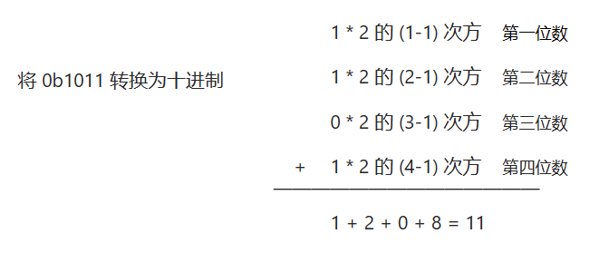
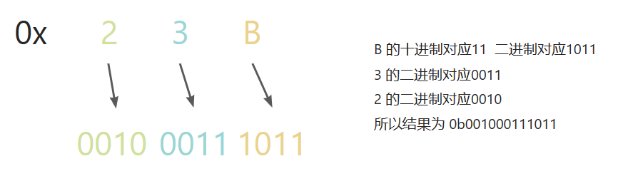

对于整数，有四种表示方式：

二进制：`0,1`，满 2 进 1，以 0b 或 0B 开头。

十进制：`0-9`，满 10 进 1。

八进制：`0-7`，满 8 进 1，以数字 0 开头表示。

十六进制：`0-9,A(10)-F(15)`，满 16 进 1，以 0x 或 0X 开头表示，A-F不区分大小写。

## 二进制转十进制

从最低位(右边)开始，将每个位上的数提取出来，乘以2的(位数-1)次方，然后求和。

## 八进制转十进制

从最低位(右边)开始，将每个位上的数提取出来，乘以8的(位数-1)次方，然后求和。

## 十六进制转十进制

从最低位(右边)开始，将每个位上的数提取出来，乘以16的(位数-1)次方，然后求和。

## 十进制转二进制

将该数不断除以2，直到商为0，将每步得到的余数倒过来，就是对应的二进制。

## 十进制转八进制

将该数不断除以8，直到商为0，将每步得到的余数倒过来，就是对应的八进制。

## 十进制转十六进制

将该数不断除以16，直到商为0，将每步得到的余数倒过来，就是对应的十六进制。

## 二进制转八进制

从低位开始，将二进制数每三位一组，转成相对应的八进制数即可。

## 二进制转十六进制

从低位开始，将二进制数每四位一组，转成对应的十六进制数即可。

## 八进制转二进制

将八进制数每一位，转成对应的 三位的 二进制数即可。

## 十六进制转二进制

将十六进制数每一位，转成对应的 四位的 二进制数即可。

## 原码、反码、补码

原码就是符号位加上真值的绝对值，即用第一位表示符号，其余位表示值。**0表示正数，1表示负数**

比如如果是8位二进制：

* 0000 0001：表示1
* 1000 0001：表示-1

反码的表示方法是：

* 正数的反码是其本身
* **负数的反码**是在其原码的基础上，**符号位不变，其余各个位取反**

补码的表示方法是：

* 正数的补码就是其本身
* 负数的补码是在其原码的基础上，符号位不变，其余各位取反，最后+1
* **负数的补码**等于**它的反码+1**，**负数的反码**等于**负数的补码-1**

1. 正数的原码、反码、补码都是一样的
2. 0的反码、补码都是0
3. java没有无符号数，Java的数都是有符号的
4. 计算机在运算的时候，都是以补码的方式来运算的
5. 当看运算结果的时候，要看它的原码